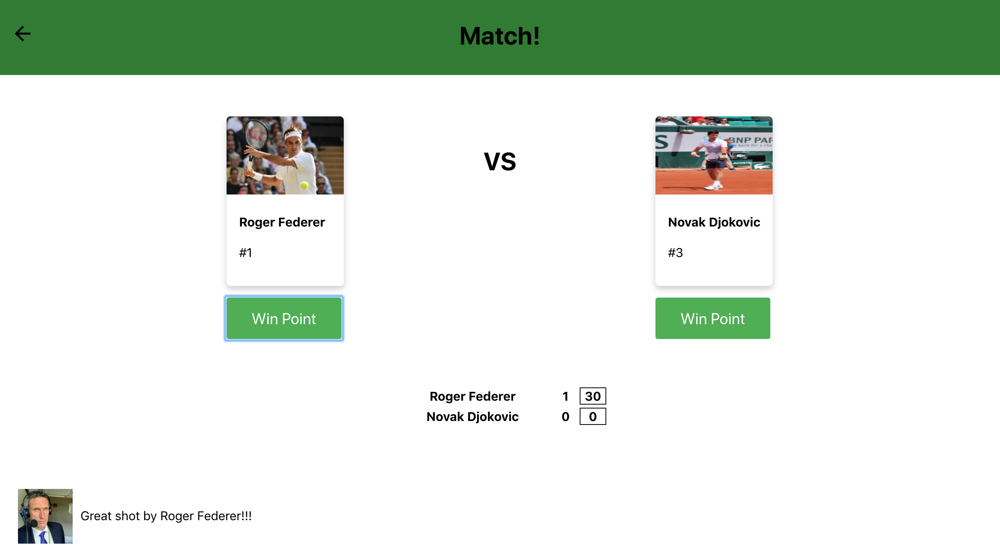

# Tennis Kata
Implementation of a simple tennis game using react/redux and nodejs

## Installing / Getting started
Get into the "frontend" directory

```bash
cd frontend
```

Install all necessary dependencies

```bash
npm install
```

## Test
To run all the tests, run:
```bash
npm test
```

## Run
To run all the web app, run:
```bash
npm start
```
<a>http://localhost:3000/</a>
## Licensing

"The code in this web app is licensed under MIT license."

## Author
[Niklaus Geisser](https://github.com/nik1168)
